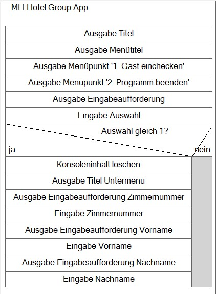
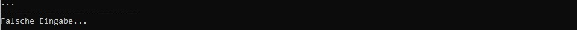
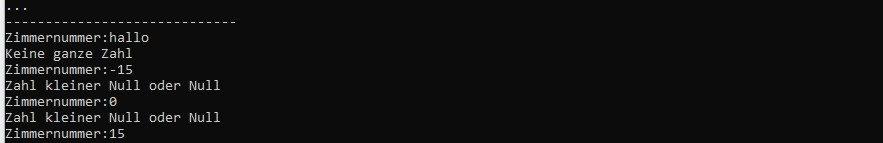
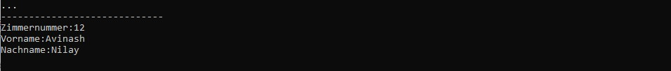

  

        
  

  
 
        <h1>Check-In-App MH-Hotel Group</h1>

## :dart: Hauptauftrag 
Sie haben den Auftrag erhalten ein Konsolenanwendung zu entwerfen, welche die Daten eines Gastes einlesen und ausgeben kann. Der Kunde möchte die Software anschließend in sein bereits vorhandenes System einbinden. Dieses Repository hat Herr Schneider für Sie aufgesetzt und die Abforderungen des Auftraggebers ausformuliert.

### Anforderungen
  
Der Benutzer wählt in eineme Menü zwischen den Punkten 
1. Gast einchecken (Zimmernummer, Vorname und Nachname werden eingegeben)
2. Gast auslesen (Zimmernummer, Vorname und Nachname werden ausgegeben)
3. Programm beenden 

Das Program verarbeitet immer jeweils einen Gast(Bei der Eingabe eines neuen Gastest, wird der alte überschrieben).   
  
**Rahmendbedingungen**

|Framework Anforderungen | Anforderungen an die Benutzerfreundlichkeit| Externe Anforderungen|
|----------|----------|----------|
|Programmiert in C#|Programm und einzelne Optionen sind beliebig oft wiederholbar.|Alle gesetzlichen vorgaben werden eingehalten.|
|Konsolenanwendung|Eine Fehleingabe führt zu einer erneuten Eingabeaufforderung.|Moralische und ethische Grundsätze sind einzuhalten.|
|.NET 6 |Alle eingaben werden über die Tastatur gemacht.|-|
|-|Die Konsole wird beim Verlassen des aktuellen Moduls gelöscht.|-|
|-|Das Programm wird auf Befehl beendet.|-|

  
  
## :bookmark_tabs: Informationsquelle
Das Informationsmaterial zur Aufgabe finden Sie [hier](./AddFiles/Informationsmaterial)

---

### Aufgabe 1: Hotel-Check-In-App Grundgerüst implementieren

Um Ihnen den Einstieg zu erleichtern hat Herr Schneider einen ersten Entwurf erstellt. Das Struktugramm Zeigt eine Version des Programs, welche die Gästedaten einliest wenn den Benutzer den ersten Menüpunkt auswählt. Wählt der benutzer nicht den Menüpunkt 1 aus, beendet sich das Programm. 

  
**a)** Implementieren sie das von Herr Schneider entworfene Program.
  
> :information_source: **Hinweise**:exclamation:
> + Beachten Sie, dass Sie die Ausgabe unter der gestrichelten Linie erzeugen müssen, um die Aufgabe zu bestehen.
 
---
  
### Aufgabe 2: Hotel-Check-In-App Wiederholung einbauen

Nutzen Sie die Implementierung aus Aufgabe 1 um das Programm zu erweitern.   
Die Anwendung soll solange wiederholt werden, bis der Benutzer im Menü die Auswahl 2 trifft.   
Bei einer ungültigen Auswahl wird eine Fehlermeldung ausgegeben. 

**a)** Passen Sie das Struktogram aus Aufgabe 1 so an, dass die Erweiterung funktional ist. Erweitern Sie das Struktogramm von Herr Schneider und laden sie dieses unter der Dateibezeichnung "HotelCeckInApp_Wiederholung_STR.jpg" in den Ordner "AddFiles" hoch.
  

**b)** Implementieren Sie das Program.
  
> :information_source: **Hinweise**:exclamation:
> + Beachten Sie, dass Sie die Ausgabe unter der gestrichelten Linie erzeugen müssen, um die Aufgabe zu bestehen.
> + Sie müssen das Dateiformat und die Namensgebung einhalten damit das Struktogramm Ihnen hier angezeigt wird.

Beispiel:

  
---

### Aufgabe 3: Hotel-Check-In-App Zimmernummer nicht korrekt

Nutzen Sie die Implementierung aus Aufgabe 2 um das Programm zu erweitern.   
Erweitern Sie das Program so, dass die Fehlermeldung "Keine ganze Zahl" ausgegeben wird, wenn der Nutzer für die Zimmernummer keine ganze Zahl eingibt.
Weiter soll die Fehlermeldung "Zahl kleiner Null oder Null" ausgegeben werden, wenn der Nutzer für die Zimmernummer ein 0 oder einer negative Zahl eingibt.

**a)** Erweitern Sie das Struktogramm aus Aufgabe 2 und laden sie diesen unter der Dateibezeichnung "HotelCeckInApp_Zimmernummer_STR.jpg" in den Ordner "AddFiles" hoch.  

**b)** Implementieren Sie das Program.

> :information_source: **Hinweise**:exclamation:
> + Beachten Sie, dass Sie die Ausgabe unter der gestrichelten Linie erzeugen müssen, um die Aufgabe zu bestehen.
> + Sie müssen das Dateiformat und die Namensgebung einhalten damit das Struktogramm Ihnen hier angezeigt wird.

Beispiel:

---

### Aufgabe 4: Hotel-Check-In-App Gast Ausgeben

Nutzen Sie die Implementierung aus Aufgabe 3 um das Programm zu erweitern. Erweitern Sie das Program um den Menüpunkt "2. Gast ausgeben". Bei der Auswahl dieses Menüpunktes sollen die Daten des Gastes ausgegeben werden. Legen sie die Beendigung des Programms auf den Menüpunkt 3.

**a)** Erweitern Sie das Struktogramm aus Aufgabe 3 und laden sie diesen unter der Dateibezeichnung "HotelCeckInApp_GastAusgeben_STR.jpg" in den Ordner "AddFiles" hoch.  

**b)** Implementieren Sie das Program.

> :information_source: **Hinweise**:exclamation:
> + Beachten Sie, dass Sie die Ausgabe unter der gestrichelten Linie erzeugen müssen, um die Aufgabe zu bestehen.
> + Sie müssen das Dateiformat und die Namensgebung einhalten damit das Struktogramm Ihnen hier angezeigt wird.

Beispiel:

---
  
### Aufgabe 5: Arbeit einreichen

1. In Visual Studio 2022 das Fenster "Git-Änderungen" aufrufen
2. Eine kurze Beschreibung Ihrer Änderungen in die Textbox eingeben und "commit für alle" klicken
3. Mit dem Pfeil nach oben die Arbeit auf GitHub pushen.
4. Das Repository im Brower aufrufen und aktualisieren um die Änderungen zu bestätigen.
5. Im Pull-Request die Nachricht "Bereit zum Bewerten" hinterlassen, damit Ihre Lehrkraft weiss das Sie fertig sind.

---
  
# :100: Erfolgskriterien
  
+ Eingesetzten Quellcode kommentieren
+ Quellcode schreiben der lesbar ist und mit Hilfe einer logischen Folge das Problem löst
+ Programmausgabe die korrekt, lesbar und richtig formatiert ist 
